# AWS Lab 11 – Commit

Private EKS (Fargate) lab with an internal-only HTTPS app, GitOps delivery,
observability, and autoscaling. All infra is defined in Terraform. All runtime
state on the cluster is GitOps-driven through Argo CD from this repo.

## Architecture at a glance

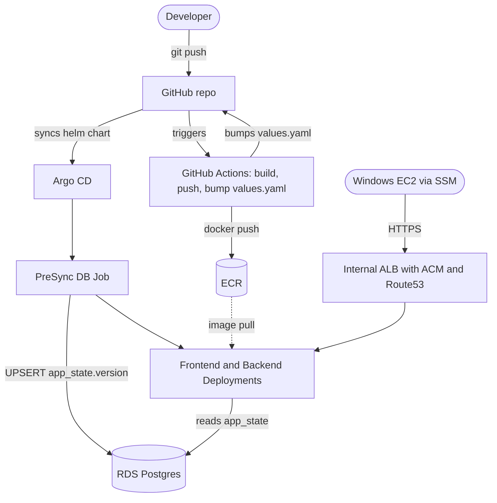

Bootstrap (one-time, manual) is not shown above: the
`bootstrap-cluster` and `observability-bootstrap` workflows use SSM into the
Linux management EC2 to `helm install` the ALB controller, external-dns, Argo
CD, and `kube-prometheus-stack`.

Validation traffic originates from a private Windows EC2 reached over SSM port
forwarding; there are no public endpoints to the cluster or the app.

## Repository layout

```
.github/workflows/      CI/CD (build+bump, cluster bootstrap, observability bootstrap)
argocd/                 Argo CD Helm values + root Application manifest
backend/                Flask backend (Dockerfile, app.py, requirements.txt)
frontend/               Static nginx frontend (Dockerfile, index.html, nginx.conf)
helm/lab-commit/        Helm chart deployed by Argo CD (FE/BE/Ingress/HPA/PreSync Job)
observability/          Grafana ingress applied after kube-prometheus-stack
scripts/                Manual fallback scripts
terraform/              All AWS infra (VPC, EKS, RDS, ECR, ACM, R53, IAM, EC2, OIDC)
```

The Helm chart in `helm/lab-commit/` is the single source of truth for what runs
in the `app` namespace; no raw manifests duplicate it.

## One-time setup

1. Populate `terraform/terraform.tfvars` (`eks_admin_principal_arn`, region, etc.).
2. `cd terraform && terraform init && terraform apply`.
3. Configure GitHub repo secrets:
   - `AWS_ROLE_TO_ASSUME` = value of TF output `github_actions_role_arn`.
   - `MGMT_INSTANCE_ID` = value of TF output `linux_mgmt_instance_id`.
   - `ARGOCD_ACM_CERT_ARN` = value of TF output `argocd_acm_certificate_arn`.
4. Trigger `Bootstrap Cluster (Argo CD)` workflow from the Actions tab. It
   installs the ALB controller, external-dns, and Argo CD, then applies the
   Argo CD `Application` that deploys the Helm chart.
5. Trigger `Bootstrap Observability` workflow. It installs
   `kube-prometheus-stack` and applies `observability/grafana-ingress.yaml`.
6. Install the EKS managed `metrics-server` add-on (Fargate-friendly). HPA
   requires it:
   ```bash
   aws eks create-addon \
     --cluster-name lab-commit-eks-cluster \
     --addon-name metrics-server \
     --region us-east-2
   ```

## Day-to-day flow

- Edit `frontend/` or `backend/` and push to `main`.
- The matching GitHub Actions workflow builds the image, pushes it to ECR, and
  bumps the image tag (and `app.version` for frontend) in
  `helm/lab-commit/values.yaml`.
- Argo CD detects the change and syncs; a PreSync Job updates the
  `app_state.version` row in RDS to the new version before the rollout.
- The user-visible `Hello Lab-commit <version>` string is driven by
  `app.version` in `values.yaml` (written to RDS by the PreSync Job and read
  back by the backend), not by the frontend image tag itself.

## Validation

From the Windows EC2 (via SSM), open `https://lab-commit-task.lab-commit.internal`
to see `Hello Lab-commit <version>`. Argo CD UI is at
`https://argocd.lab-commit.internal` and Grafana is at
`http://grafana.lab-commit.internal`.

## Autoscaling demo

HPA is declared in the Helm chart (`frontend.hpa` in `values.yaml`, template
`templates/frontend-hpa.yaml`). Generate load with several parallel busybox
pods hitting the frontend Service and watch `kubectl -n app get hpa -w` scale
the deployment up, then back down after the stabilization window.

## Known caveats

- The frontend ingress certificate ARN and FQDN are pinned in
  `helm/lab-commit/values.yaml`. Reviewers redeploying to a different account
  must update the ACM ARN from the TF output `internal_app_acm_certificate_arn`
  and the `ingress.host` to match `internal_app_fqdn`.
- Fargate kubelets reject unauthenticated scrapes; we use the EKS managed
  `metrics-server` add-on for HPA instead of a self-managed one.
- Argo CD may show a transient `ComparisonError: status.terminatingReplicas`
  noise on Deployments — cosmetic, sync still completes.

## Evidence

Screenshots captured during the lab run, covering each requirement.

**Internal-only app served over HTTPS (self-signed ACM), reached via
Windows EC2 through SSM.**

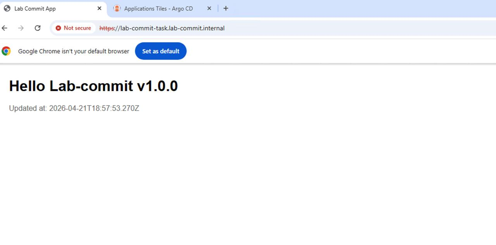
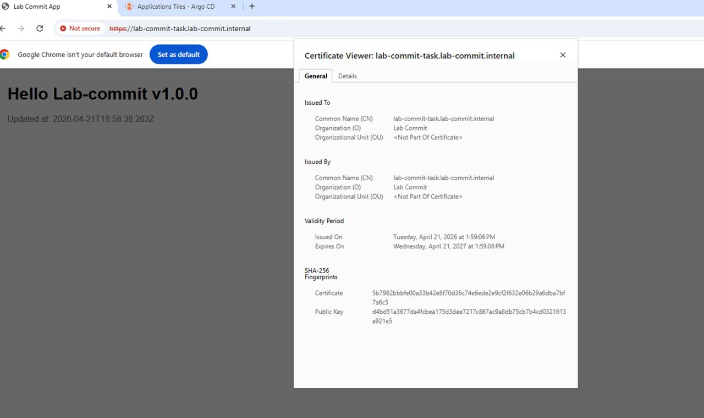

**CI/CD — GitHub Actions build and push both images, bump Helm values.**

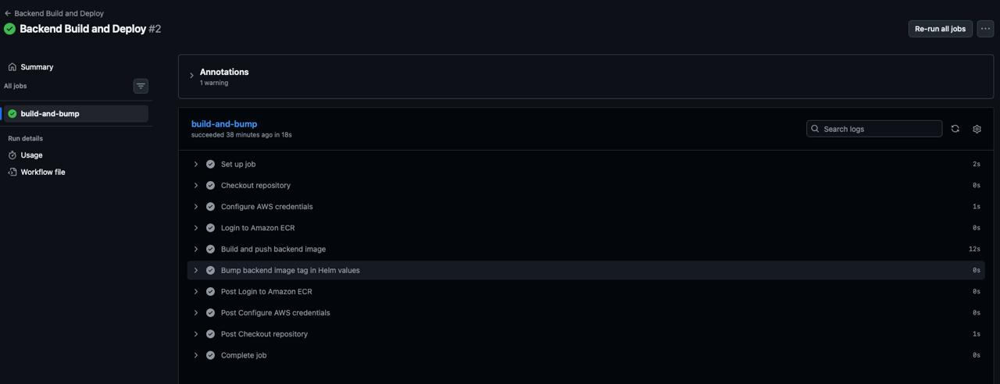
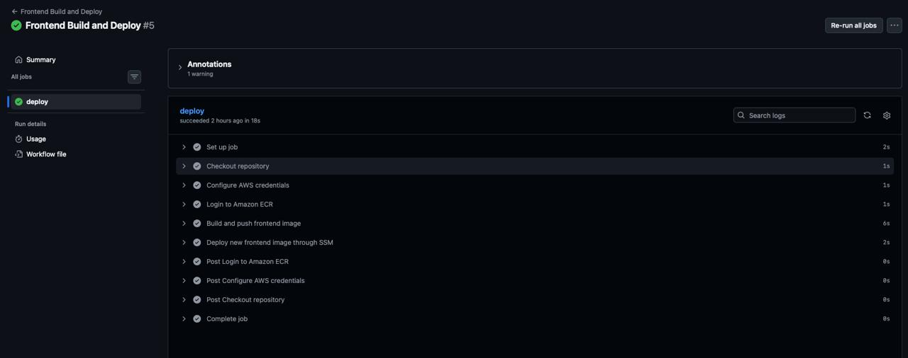

**GitOps — Argo CD watching this repo, synced and healthy.**

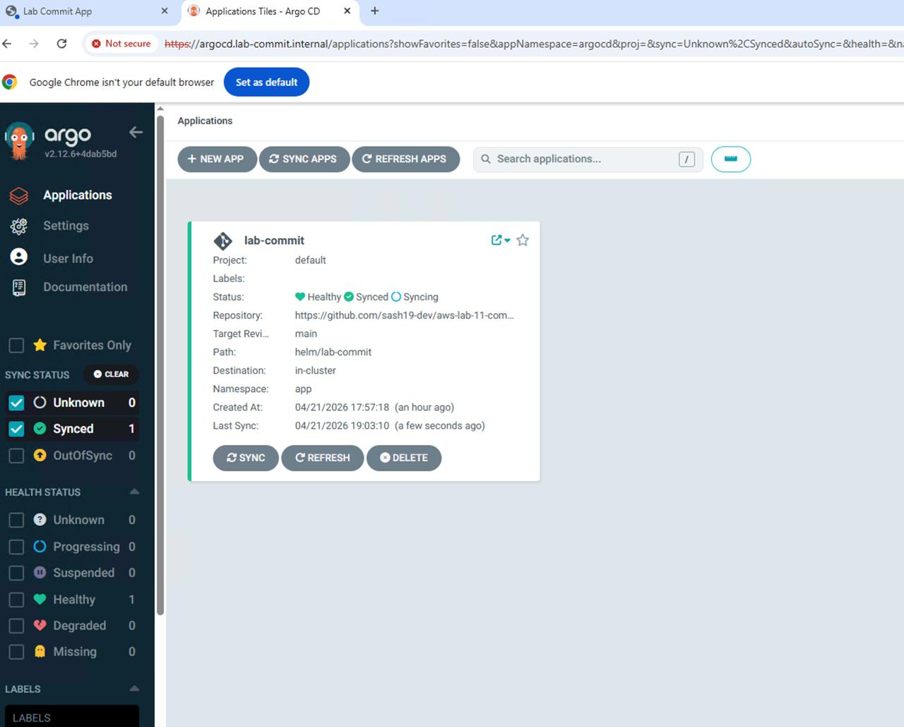

**End-to-end version update after a frontend commit.** The PreSync Job
wrote the new version to RDS, the backend read it back, and the browser
rendered the new string.

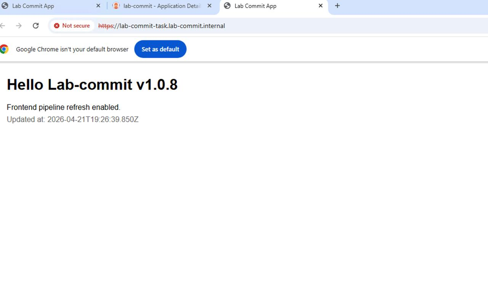
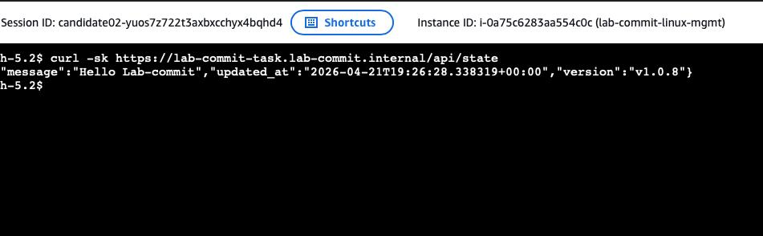

**Cluster state — all workloads running on Fargate.**

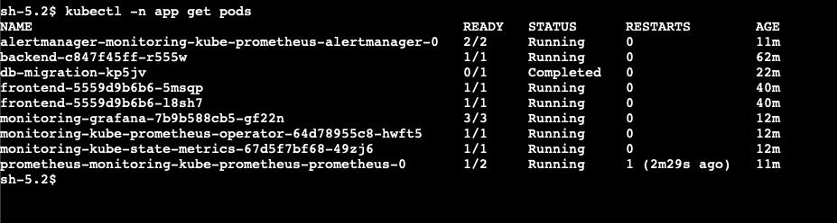

**Observability — Grafana dashboard against Prometheus in-cluster.**

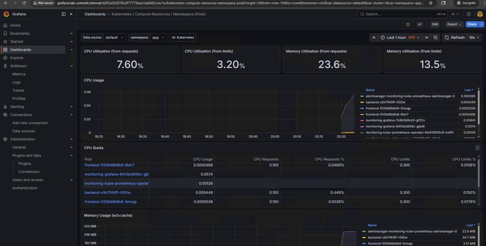

**Autoscaling — HPA scales the frontend up under load and back down.**

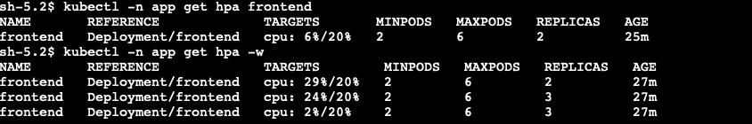
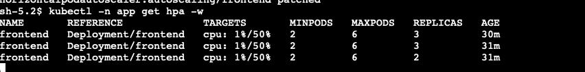

## Teardown

```bash
cd terraform
terraform destroy
```

If destroy fails, empty ECR, delete non-default Route53 records in the private
zone, and re-run.
